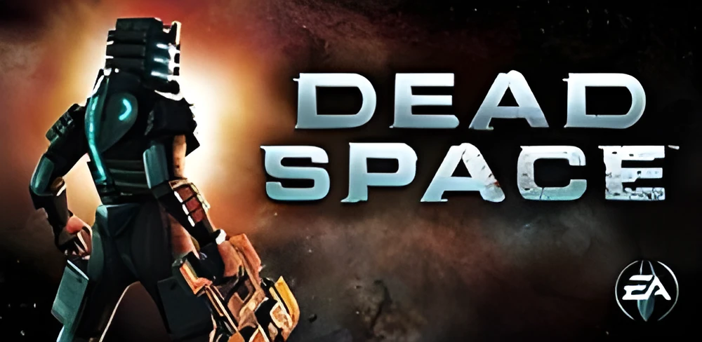

| + | pause |
| − | the RIG (inventory) |
| + and − together | the port's settings |

# deadspace_nx

**Dead Space: Sabotage on Nintendo Switch**

An unofficial Nintendo Switch wrapper for the Android version of
**Dead Space** (2011), the mobile game also known as *Dead Space: Sabotage*.

[-3DDC84?style=for-the-badge&logo=android&logoColor=white)](#)

---

The port is called *Dead Space: Sabotage* so that it is not taken for the 2008
console game: this is the mobile one, by IronMonkey Studios. It is built on
the [android32](https://github.com/aks796/android32) runtime. It is an early
release: [docs/release-completion.md](docs/release-completion.md) lists what
is done and what is not, [NOTES.md](NOTES.md) how it works.

The port is a wrapper: it loads the game's own code from your APK and gives
it what it expects from Android. **No game files are included.** You need
your own copy of the game.

## What you need

- A Switch with Atmosphère and [sphaira](https://github.com/ITotalJustice/sphaira)
- Your own APK of **Dead Space 1.2.0** (`com.eamobile.deadspace_full_azn`, the
  Amazon Appstore build, about 295 MB with the game's data inside). Other
  builds are not supported yet.
- About 350 MB free on the SD card besides the APK, for the first start.

## Installing

1. Copy `deadspace_nx.nro` to `sd:/switch/deadspace_nx/`.
2. Copy your APK into the same folder (any file name ending in `.apk`).
3. In sphaira: **Homebrew › Dead Space: Sabotage › Install Forwarder**.
4. Start the new icon on the HOME menu. The first start prepares the game's
   data inside the APK and unpacks its engine; it takes a few minutes, once.

To update, replace the NRO in the folder and start the icon: the port
updates itself.

To remove it, delete `sd:/switch/deadspace_nx/` and the folder under
`atmosphere/contents/` named in `title_id.txt`.

## Controls

| Switch | Game |
| --- | --- |
| Left stick | move |
| Right stick | look, aim |
| L / ZL (hold) | aim |
| ZR | fire while aiming; melee otherwise |
| R | the weapon's other mode, while aiming |
| B | interact (doors, items), confirm |
| A | kinesis (again: throw) |
| Y | reload |
| X | quick turn; stasis while aiming |
| Right stick click | jump, in zero gravity |
| Left stick click | motion aiming on / off |
| D-pad left / right | previous / next weapon |
| D-pad up / down | melee / locator |
| + | pause |
| − | the RIG (inventory) |
| Touch screen | as on a phone (handheld) |

In the menus (the title screens, the pause menu, the RIG, the store, a
question asked in a level) the
sticks and the D-pad move a pointer: **A** touches what is under it, **B**
goes back.

Motion aiming turns the camera with the controller's gyroscope (the console's
own in handheld mode). It is off until the left stick is clicked; a disc at
the top of the screen says on, a ring off. By default it counts only while
the aim button is held.

## Settings

**+ and − pressed together** open the port's settings over the game (a level
is paused first): the camera's sensitivity, motion aiming on or off, its
sensitivity, whether it counts only while aiming, and its two directions.
Up and down choose, left and right change, **B** closes and saves.

The same options, and the others (resolution, swapping A and B, the touch
screen), are in `sd:/switch/deadspace_nx/config.ini`, written on the first
start. Each option is explained in the file.

## Reporting a problem

Open an issue with `debug.log` (and `crash.log`, if there is one) from the
game's folder. The logs carry an identifier of the port's install on your
console.

## Building

GitHub Actions builds every push (`.github/workflows/build.yml`); the
`deadspace_nx_sd` artifact is the SD card layout. Locally, with Docker:
`git submodule update --init`, libnx32 and mesa32 as the android32 README
says, `python3 runtime/tools/gen_imports.py`, `./build.sh`, then
`launcher/build.sh`.

## Credits

- [android32](https://github.com/aks796/android32), libnx32 and mesa32 by aks796
- [deadspace-vita](https://github.com/v-atamanenko/deadspace-vita) by Volodymyr
  Atamanenko: the way the sticks drive the game's touch controls
- The `.so` loader derives from the work of Andy Nguyen (TheOfficialFloW) and fgsfds

## Disclaimer

DEAD SPACE is a trademark of Electronic Arts Inc. This project is not
affiliated with, endorsed or sponsored by Electronic Arts. It contains no
code, executables or assets of the game.

## License

MIT, see [LICENSE](LICENSE).
